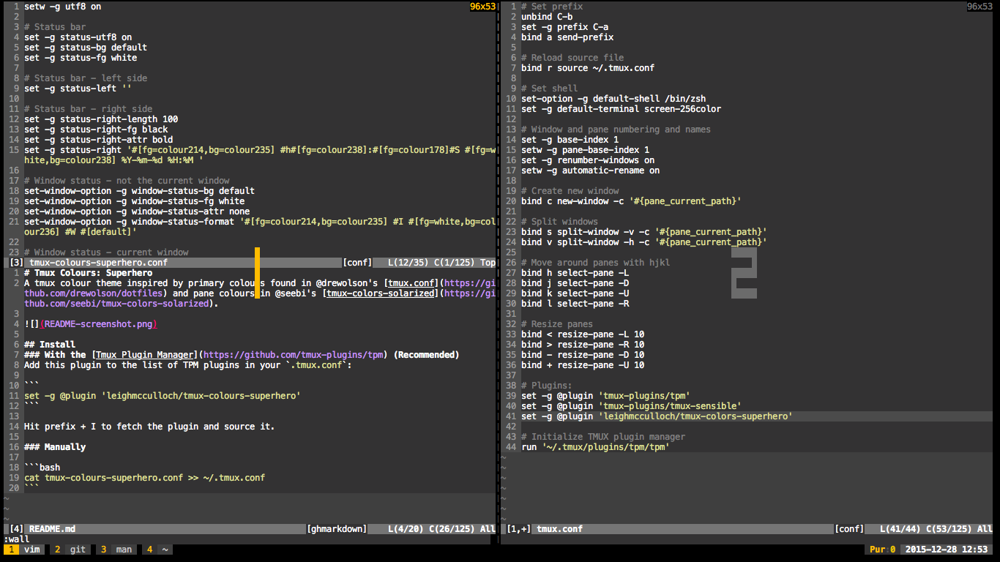

# Tmux Colours: Superhero
A tmux colour theme inspired by primary colours found in [drewolson/dotfiles](https://github.com/drewolson/dotfiles) and pane colours in [seebi/tmux-colors-solarized](https://github.com/seebi/tmux-colors-solarized).



## Install
### With the [Tmux Plugin Manager](https://github.com/tmux-plugins/tpm) (Recommended)
Add this plugin to the list of TPM plugins in your `.tmux.conf`:

```
set -g @plugin 'leighmcculloch/tmux-colours-superhero'
```

Hit prefix + I to fetch the plugin and source it.

### Manually

```bash
cat tmux-colours-superhero.conf >> ~/.tmux.conf
```
